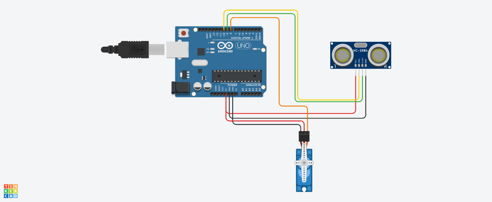

# 🚨 Ultrasonic Object Detection with Arduino + Servo

This project demonstrates how to build a simple object detection system using an **HC-SR04 ultrasonic sensor** and an **SG90 servo motor**. When an object comes within 20 cm, the servo motor reacts accordingly.

---

## 🧠 How It Works

- The **HC-SR04 ultrasonic sensor** continuously measures the distance to an object.
- If an object is detected within a threshold distance (e.g. **< 10 cm**), the **servo motor** rotates to respond.
- Otherwise, the servo remains at its default position.

---

## 🔌 Circuit Diagram

Below is the wiring schematic for this project:

---

## 🔧 Components Used

More details in [`components.txt`](./components.text)

---

## 💾 Arduino Code

The full Arduino sketch is in [`object_detection.ino`](./object_detection.ino)

---
